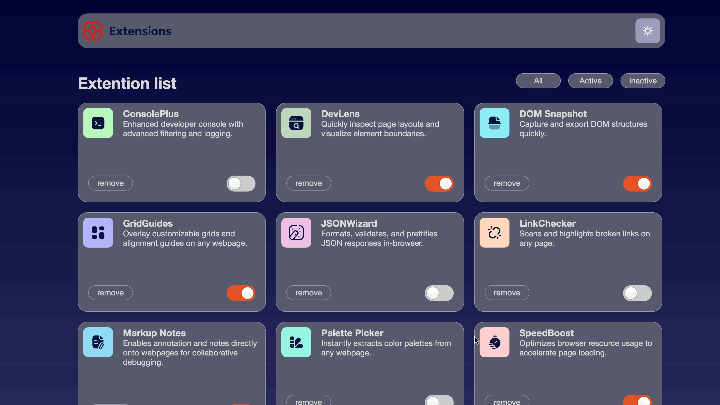

#ABOUT

Completed a Frontend Mentor challenge to build a Browser Extension Manager UI using HTML, CSS, and JavaScript, focusing on pixel-perfect design replication and creating a clean, responsive interface.

Available features:

- Toggle extensions between active and inactive states
- Filter active and inactive extensions
- Remove extensions from the list
- Select their color theme

